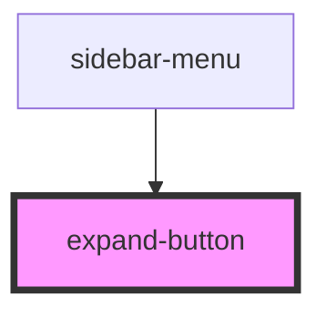

# expand-button

<!-- Auto Generated Below -->

## Properties

| Property     | Attribute     | Description                                                                              | Type                                  | Default   |
| ------------ | ------------- | ---------------------------------------------------------------------------------------- | ------------------------------------- | --------- |
| `direction`  | `direction`   | The direction to expand. E.g. 'right' means it goes from '<' to '>', from left to right. | `"down" \| "left" \| "right" \| "up"` | `'right'` |
| `isExpanded` | `is-expanded` |                                                                                          | `boolean`                             | `false`   |

## Dependencies

### Used by

 - [sidebar-menu](../sidebar-menu)

### Graph

----------------------------------------------

*Built with [StencilJS](https://stenciljs.com/)*
