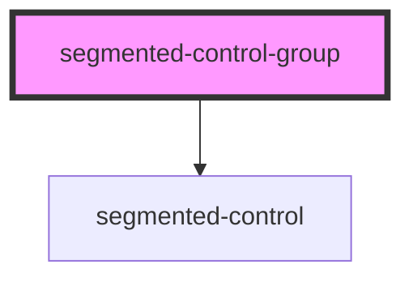

# segmented-control-group

<!-- Auto Generated Below -->

## Properties

| Property         | Attribute         | Description | Type       | Default     |
| ---------------- | ----------------- | ----------- | ---------- | ----------- |
| `optionLabels`   | --                |             | `string[]` | `undefined` |
| `selectedOption` | `selected-option` |             | `number`   | `0`         |

## Events

| Event      | Description | Type                  |
| ---------- | ----------- | --------------------- |
| `selected` |             | `CustomEvent<string>` |

## Dependencies

### Depends on

- [segmented-control](../segmented-control)

### Graph

----------------------------------------------

*Built with [StencilJS](https://stenciljs.com/)*
