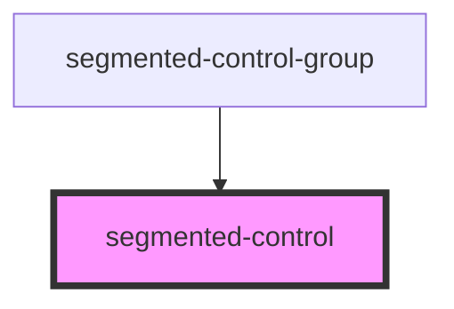

# segmented-control

<!-- Auto Generated Below -->

## Properties

| Property      | Attribute      | Description | Type      | Default     |
| ------------- | -------------- | ----------- | --------- | ----------- |
| `isSelected`  | `is-selected`  |             | `boolean` | `undefined` |
| `optionLabel` | `option-label` |             | `string`  | `undefined` |

## Events

| Event      | Description | Type                |
| ---------- | ----------- | ------------------- |
| `selected` |             | `CustomEvent<void>` |

## Dependencies

### Used by

 - [segmented-control-group](../segmented-control-group)

### Graph

----------------------------------------------

*Built with [StencilJS](https://stenciljs.com/)*
