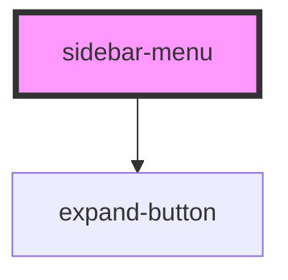

# sidebar-menu

<!-- Auto Generated Below -->

## Properties

| Property    | Attribute   | Description | Type                | Default  |
| ----------- | ----------- | ----------- | ------------------- | -------- |
| `placement` | `placement` |             | `"left" \| "right"` | `'left'` |

## Dependencies

### Depends on

- [expand-button](../expand-button)

### Graph

----------------------------------------------

*Built with [StencilJS](https://stenciljs.com/)*
